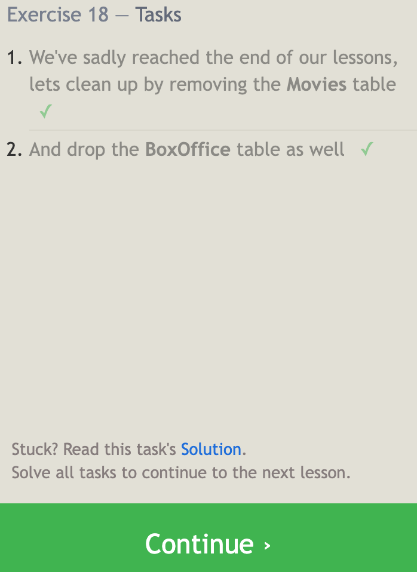

# SQL Practice

## Learn SQL

- SQL is Structured Query Language
- Search language that tells a database what you are searching for
- database made up of tables like exel spreadsheets
- keywords:
  - SELECT
  - LIMIT
  - OFFSET
  - ORDER BY
  - FROM

